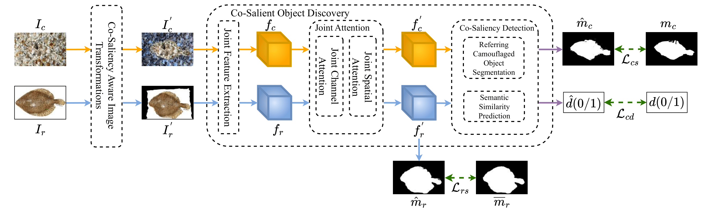

# 🧩 CIRCOD-TF: TensorFlow Implementation of Co-Saliency Inspired Referring Camouflaged Object Discovery

<div align="center">


**Inspired by:**  
[CIRCOD: Co-Saliency Inspired Referring Camouflaged Object Discovery (WACV 2025)](https://openaccess.thecvf.com/content/WACV2025/papers/Gupta_CIRCOD_Co-Saliency_Inspired_Referring_Camouflaged_Object_Discovery_WACV_2025_paper.pdf)  
*Avi Gupta, Koteswar Rao Jerripothula, and Tammam Tillo*  
Indraprastha Institute of Information Technology, Delhi, India  

</div>

---

## 🧠 Overview

This repository presents a **TensorFlow 2.x reimplementation** of the **Saliency Enhancement Network (SEN)** module from the original **CIRCOD** framework.  
Our goal is to reproduce and simplify the key idea behind **Co-Saliency Inspired Referring Camouflaged Object Discovery**, which detects objects concealed within their surroundings by leveraging an additional **referring image**.

The model performs **camouflaged object segmentation** on benchmark datasets such as **COD10K**, **NC4K**, and **CAMO**, demonstrating the applicability of TensorFlow for this challenging visual task.

---

## 🧩 Network Architecture

<div align="center">

</div>

### Key Components
- **ConvBlocks** – Extract local and structural features.  
- **ConvTransposeBlocks** – Upsample and reconstruct spatial details.  
- **Skip Connections** – Preserve high-frequency information between encoder and decoder.  
- **Sigmoid Output Layer** – Produces the binary camouflage mask.

---

## 📜 Abstract

Camouflaged Object Detection (COD) aims to identify objects that are visually similar to their background. The challenge arises from minimal contrast between the object and its surroundings.  
By incorporating a **referring image** where the target object is clearly visible, we can better locate the same object when it is camouflaged.  

The CIRCOD framework introduces a novel problem setup — **Referring Camouflaged Object Discovery (RCOD)**.  
Here, segmentation occurs *only if* the object in the referring image is also present in the camouflaged image. Otherwise, the model returns a blank mask.  

To achieve this, CIRCOD proposes:
- **Co-Saliency-Aware Image Transformation (CAIT)** – Reduces appearance and structural variations.  
- **Co-Salient Object Discovery (CSOD)** – Exploits similarities between referring and camouflaged images.  

This repository focuses on implementing and training the **SEN** component of the full CIRCOD pipeline.

---

## 📦 Dataset Preparation

We use publicly available COD datasets organized as follows:
```
data_root/
   ├── COD10K/
   │   ├── Images/
   │   ├── GT
   └── NC4K
   │   ├── Images/
   │   ├── GT
   ├── CAMO/
   │   ├── Images/
   │   ├── GT
   ├── R2C7K/
   │   ├── Camo/
   │   ├── Ref
   ├── Ref-1K/
   │   ├── Images/
   │   ├── GT
```


You can access the datasets from this [Google Drive link](https://drive.google.com/drive/folders/16pzODVztI8ea0BRxJC0ZSobG7b56iXb-?usp=sharing).

## ⚙️ Setup Instructions

### 1️⃣ Environment Setup

Install dependencies:
```bash
pip install tensorflow numpy matplotlib scikit-learn pillow
````

## Contributors and Contact

- **Mathujan Shanmugavadivel** – 220389U.
- **Pirathishanth Arudshelvan** – 220480P.
